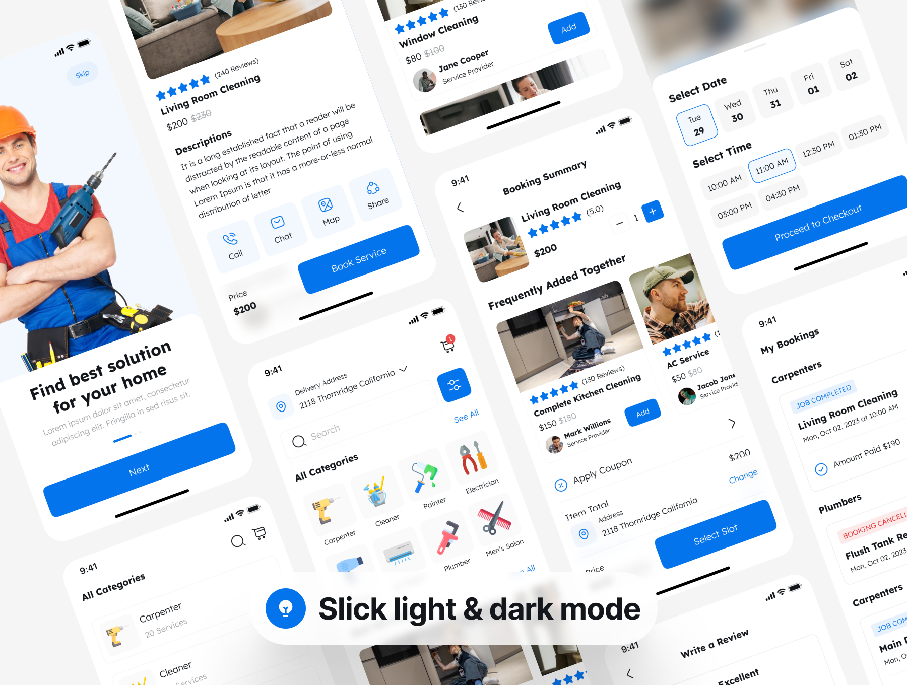

# TipTopp

> Redefining Your Home Experience.

## Experience the future of on-demand household services with our platform, where quality and convenience meet.

Introducing a revolutionary platform that seamlessly connects individuals with top-quality, pre-screened independent professionals for on-demand household cleaning, handyman, and DIY services. Our user-friendly interface allows users to easily find and hire skilled professionals for their specific needs, ensuring a hassle-free experience. Whether it's a thorough home cleaning, a skilled handyman for repairs, or assistance with DIY projects, our platform provides a trusted and efficient solution. Enjoy the convenience of accessing reliable service providers at your fingertips, making home maintenance and improvement tasks a breeze.

## Quick Start

```shell
# This project uses node v18.18.2
# If you already have that version installed locally using nvm, then use within the project directory
nvm use
# Alternatively, you can install it by running within the project directory
nvm install

# Install application dependencies
yarn install

# Run the application
yarn start:dev
```

## Design & User Interface


